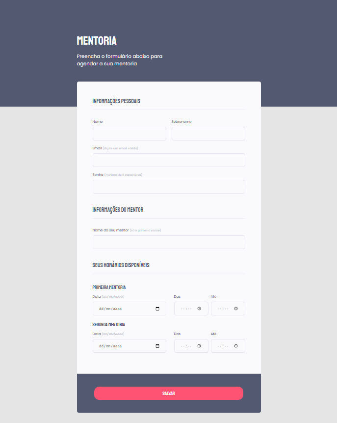

#  Desafio Stage 02 -  Formulario Intermediario 

> Trilha Explorer 

Projeto construido Como desafio no stage 02 

👉🏼[Clique aqui para accessar](https://desafio-stage-02-formulario-int.netlify.app/)

##  🔧 Tecnologias

- Html 
- Css
- Git e Github

##  🖥️ O que aprendi Nesse Desafio 

Foi repassado alguns conceitos mexendo com o figma na construção de formulario

## Contato 💻🧑‍💻 

juniorjose1925@gmail.com

https://www.linkedin.com/in/jose-martinez-352032222/
